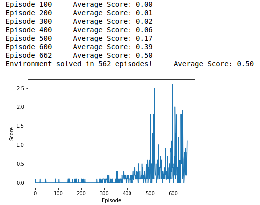

# Udacity Deep Reinforcement Learning: Collaboration & Competition Report

## The MADDPG Algorithm
Please see https://github.com/haohuynh/DRL_Continuous_Control/blob/main/Report.md for the fundamental characteristics of DDPG.
For this project, Collaborative MADDPG simply utilizes the same Actor & Critic of the DDPG.

## Plot of Rewards

## Ideas for Future Work
Try to implement both Independent & Master Agent approaches with different Actor-Critic algorithms, then compare & contrast the effectiveness of these methods.
